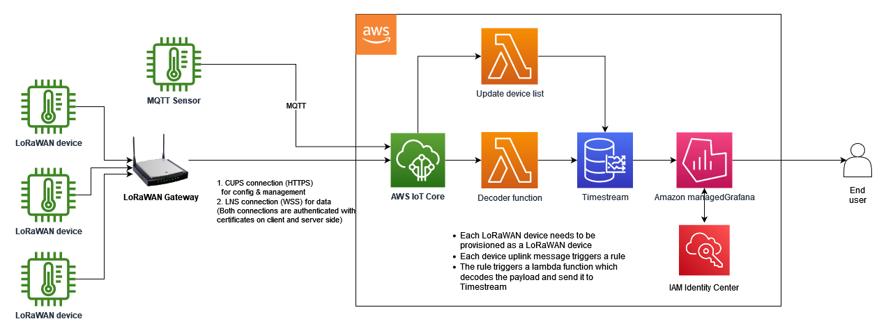
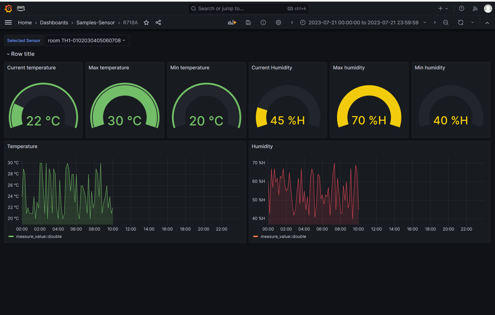

## IoT Accelerator - IoT Sensor Dashboard

#### Objective

This is an accelerator for creating an IoT solution to view data from sensors, predominantly LoRaWAN sensors, using AWS IoT services. It should be noted that since this is an accelerator, it is designed to be a starting point of your solution build journey rather than a complete solution. However, this accelerator does create all the AWS resources required to interface with LoRaWAN gateways, ingest, decode & store LoRaWAN messages, along with template dashboards for the supported types of sensors. It also supports ingesting data from any MQTT sensor which can connect and publish to IoT Core directly. Therefore, it can be used to cater to certain basic use cases with minimal customization.

This accelerator utilizes the following key AWS services:

•	AWS IoT Core – IoT Core acts as the connection point for your MQTT based sensors to the AWS cloud. IoT Core for LoRaWAN provides a fully managed LoRaWAN Network Server (LNS) that enables customers to connect wireless devices that use the LoRaWAN protocol

•	AWS Lambda – There are 2 Lambda functions in this accelerator

•	Decoder function – this function decodes the uplink data from the sensors based on the sensor’s vendor and the model. This is to decode uplink messages from LoRaWAN sensors

•	Sensor list update function – this function updates the database table with IoT thing create and delete events to maintain a table of provisioned sensors

•	Amazon Timestream – this is where the timeseries data transmitted from the sensors are stored. It also contains a separate table to maintain the list of provisioned sensors along with vendor and model information for dashboarding purposes.

•	Amazon Managed Grafana – this is used as the dashboarding layer. Users can consume the prebuilt dashboards for each model of sensor or build their own dashboards while using the given dashboards as a reference.

In the background, AWS IAM Identity Center provides the single sign on for the Amazon Managed Grafana, thus allowing the administrator the flexibility to segregate the dashboard logins from AWS account logins. It also allows the end user to utilize the same single sign on that the user might be already using on other AWS services.


#### Prerequisites:
- AWS account with privileges to create the services used in this solution listed above.
#### Features:
 - AWS IoT Core for LoRaWAN ingests uplink messages from sensors sent via LoRaWAN gateways
 - Other sensors can connect and publish directly to IoT Core
 - AWS Lambda function decodes the sensor uplink based on the vendor and model of the sensor. This allows this accelerator to supports sensors from multiple vendors. Support for sensors will be added in an on going basis.
 - Amazon Timestream stores the decoded data from sensors
 - Amazon Managed Grafana provides a flexible, no-code builder for the user to build a custom dashboard. This instnace also comes prepackaged with template dashboards for all the supported sensors which can be used out of the box for basic use cases.

#### Sample Architecture

#### Deployment:
- If this is a new AWS account, enable IAM Identity Center and create user/s
- Open the AWS cloudshell and run the command below:

```
git clone git@github.com:aws-samples/iot-x-sensordash.git && cd lorawandash && python3 setup_stack.py
```
This step will clone the repo, deploy the cloudformation template and preload the template dashboards to the Amazon Managed Grafana instance.
- Navigate to Amazon Managed Grafana in the AWS console web page and assign a user from IAM Identity Center. Make the user an admin/editor/viewer as required
- Open the Amazon Managed Grafana page (link will be printed in the shell command output. It can also be found on the Amazon Managed Grafana page in the AWS console web page) and explore!

More elaborate deployment instructions can be found here in the 

#### AWS Best practices

It should be noted that since this is an accelerator only, that there are several aspects that need to be covered prior to proceeding to a large scale producion solution.
 - Resilience - This architecture is built using AWS managed services which operate at a region level. Therefore theoretically there would be no impact to the services in the event of an individual AZ failure in the region. However in the event of a outage of the deployed AWS region, this accelerator would be deemed non functional. In cases where uptime guarantees require high availability, this archtecture should be updated to accomodate multi region failover.

 - Scalability - This accelerator utilizes managed services such as IoT Core, Timestream and Amazon Managed Grafana. Check and verify the AWS quotas for each service to determine if the service ceilings of each of the services are within requirements.

 - Security - This accelerator deploys services using a cloud formation template on your AWS account. These services and associated rles are provisioned with the least privilege principle to maximize security. No EC2 instances, Subnets, VPCs etc. are deployed in this architecture

 - Operations - This accelerator is intended to be deployed on a per customer account basis. In the case of large scale deployment to hundereds, perhaps thousands of customers, it is important to identify if central management of these deployments are required. If this is the case, follow AWS well architected and best practices guides to build the monitoring capability to operate at scale to minimize operational overhead.

#### Benefits & Next steps:

Now that the solution deployment is complete, it is time to start using it! The following steps can be followed to rollout a typical IoT dashboarding solution:

- If you are using LoRaWAN, provision LoRaWAN gateway/s in AWS IoT Core. This step will generate teh required URLs/certificates for the gateways
- Copy the URLs/certificates to the LoRaWAN gateway/s and configure as necessary. This will depend on the make and model of your LoRaWAN gateway
- Provision the LoRaWAN sensors in AWS IoT Core. You will need to select the device profile, service profile and the default destination for the sensor. It should be noted that these profiles are already created as part of the deployment and all that needs to be done is to select the profile from a drop down during sensor provisioning. 
    - Device Profile - This will depend on the type of sensor. eg: a class A LoRaWAN sensor on the AU915 band should use the AU915-A-OTAA profile.
    - Service Profile - select default
    - Destination - select default
    - Add tags 'Vendor' and 'Model' so that their uplink data can be decoded with the relevant decoder

- If your sensor can directly publish to IoT Core using MQTT, create a thing and copy the certificate to your sensor so that it can connect to IoT Core. Your sensor will need to publish to a topic in the format of 

```
    <sensor id>/tx 
    eg: mymqttsensor1/tx
```
- If you are publishing direct, your sensor will need to publish a JSON message. Each property in the JSON object will be stored as a measurement in the TImestream database.
```
eg: {
    "temperature": 25.5,
    "humidity": 60.5
}
```
- Build dashboards to suite your customer needs if required. The in built dashboards can be used to visualize current and historical data from sensors. Each dashboard has a dropdown menu which will be automatically populated with the sensors of the relevant type. eg: the R718A dashboard will have a dropdown which contains a list of all the Netvox R718A sensors provisioned in this AWS account. The user can simply select the sensor of interest and the panels in the dashboard will display data from that sensor. Sample dashboard screenshot can be seen below.

Refer the  for more details

